# Efficient Document Processing for RAG using MaxMin Chunking


## Codes

The source code can be found in  [maxmin_chunker.py](./maxmin_chunker.py) 

## Demo

An example usage/tutorial can be found in the [example_usage.ipynb](./example_usage.ipynb) notebook.

## How to Cite
```
@article{kiss2025maxmin,
  title={Max-Min Semantic Chunking of Documents for RAG application},
  author={Kiss, Csaba and Nagy, Marcell and Szil\'agyi, P\'eter},
  journal={arXiv preprint arXiv:2210.15505},
  year={2025}
}
```

## Algorithm




## Resources

- **Published Paper**: [Link to Paper](#)
- **Source Code**: maxmin_chunker.py
- **Example Usage**: example_usage.ipynb
